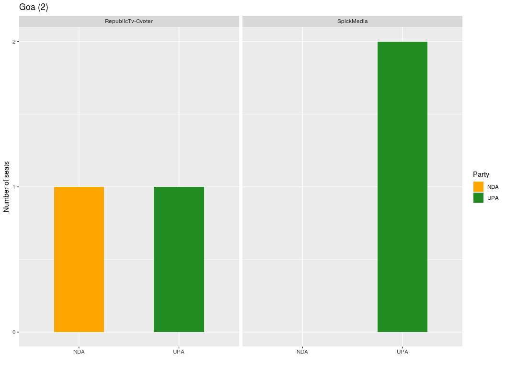

Opinion poll analysis
================
Varun Khanna
2 April 2019

Indian elections
================

The world's largest election (Indian lok sabha elections 2019) with 879 million eligible voters and 8000+ candidates is around the corner, therefore, it apt to analyze the opinion poll data to guess the mood of the electorate. In 2014 nearly half of the Indian voters preferred a party other than the BJP and its rival Congress. Let us see what does opinion polls tell us this time. In this report I have summarized the opinion poll data available in public on the wikipedia page given below:

#### **Acknowledgement**: All the data is derived from [the wikipedia page](https://en.wikipedia.org/wiki/Opinion_polling_for_the_2019_Indian_general_election) of Indian general elections 2019.

Load packages and define the functions
--------------------------------------

```r
# Load the packages
library("tidyverse")
library("kableExtra")
library("lubridate")
library("knitr")
library("janitor")
library("scales")
library("ggmap")
library("maps")
library("rgdal")
library("maptools")
library("gridExtra")
library("rgeos")

# Function to read the data and clean it up
read_clean <- function(skip, nrows)
{
  data <- read.csv("raw_data.csv", skip = skip, nrows = nrows, header = TRUE, as.is = TRUE )
data <- remove_empty(data, which = "cols")
# For consitency remove the spaces
data$Polling.agency <- gsub(" ","",data$Polling.agency)

return(data)
}

# Function to conver the data into long format
make_long <- function(df){
  df <- df %>% select(., -Lead)
  long_df <- gather(df, key = "party", value = "seats", -c(Date.published, Polling.agency))
 # Replace - sign with 0
  long_df <- long_df %>% mutate_at(vars(3:length(long_df)), funs(str_replace_all(., "-","0")))
 long_df$date <- parse_date_time(long_df$Date.published,orders = c("bdy", "bY"))
 
 long_df$seats <- as.integer(long_df$seats)
 return(long_df)
  }

# Create a blank theme
blank_theme <- theme_minimal()+
theme(
axis.title.x = element_blank(),
axis.text.x=element_blank(),
axis.title.y = element_blank(),
panel.border = element_blank(),
panel.grid=element_blank(),
axis.ticks = element_blank(),
plot.title=element_text(size=14, face="bold")
)
```

Opinion polling
---------------

```r
opinion_poll <- read_clean(1,19)

# Look at the data
kable(opinion_poll) %>% kable_styling()
```

<table class="table" style="margin-left: auto; margin-right: auto;">
<thead>
<tr>
<th style="text-align:left;">
Date.published
</th>
<th style="text-align:left;">
Polling.agency
</th>
<th style="text-align:right;">
NDA
</th>
<th style="text-align:right;">
UPA
</th>
<th style="text-align:right;">
Others
</th>
<th style="text-align:right;">
Lead
</th>
<th style="text-align:left;">
Majority
</th>
</tr>
</thead>
<tbody>
<tr>
<td style="text-align:left;">
Mar 2019
</td>
<td style="text-align:left;">
TimesNow-VMR
</td>
<td style="text-align:right;">
283
</td>
<td style="text-align:right;">
135
</td>
<td style="text-align:right;">
125
</td>
<td style="text-align:right;">
148
</td>
<td style="text-align:left;">
11
</td>
</tr>
<tr>
<td style="text-align:left;">
Mar 2019
</td>
<td style="text-align:left;">
NewsNation
</td>
<td style="text-align:right;">
273
</td>
<td style="text-align:right;">
133
</td>
<td style="text-align:right;">
137
</td>
<td style="text-align:right;">
136
</td>
<td style="text-align:left;">
1
</td>
</tr>
<tr>
<td style="text-align:left;">
Mar 2019
</td>
<td style="text-align:left;">
ABPNews-Cvoter
</td>
<td style="text-align:right;">
264
</td>
<td style="text-align:right;">
141
</td>
<td style="text-align:right;">
138
</td>
<td style="text-align:right;">
123
</td>
<td style="text-align:left;">
Hung
</td>
</tr>
<tr>
<td style="text-align:left;">
Mar 2019
</td>
<td style="text-align:left;">
IndiaTV-CNX
</td>
<td style="text-align:right;">
285
</td>
<td style="text-align:right;">
126
</td>
<td style="text-align:right;">
132
</td>
<td style="text-align:right;">
159
</td>
<td style="text-align:left;">
13
</td>
</tr>
<tr>
<td style="text-align:left;">
Mar 2019
</td>
<td style="text-align:left;">
Zee24Taas
</td>
<td style="text-align:right;">
264
</td>
<td style="text-align:right;">
165
</td>
<td style="text-align:right;">
114
</td>
<td style="text-align:right;">
99
</td>
<td style="text-align:left;">
Hung
</td>
</tr>
<tr>
<td style="text-align:left;">
Feb 2019
</td>
<td style="text-align:left;">
VDPAssociates
</td>
<td style="text-align:right;">
242
</td>
<td style="text-align:right;">
148
</td>
<td style="text-align:right;">
153
</td>
<td style="text-align:right;">
94
</td>
<td style="text-align:left;">
Hung
</td>
</tr>
<tr>
<td style="text-align:left;">
Jan 2019
</td>
<td style="text-align:left;">
TimesNow-VMR
</td>
<td style="text-align:right;">
252
</td>
<td style="text-align:right;">
147
</td>
<td style="text-align:right;">
144
</td>
<td style="text-align:right;">
105
</td>
<td style="text-align:left;">
Hung
</td>
</tr>
<tr>
<td style="text-align:left;">
Jan 2019
</td>
<td style="text-align:left;">
ABPNews-Cvoter
</td>
<td style="text-align:right;">
233
</td>
<td style="text-align:right;">
167
</td>
<td style="text-align:right;">
143
</td>
<td style="text-align:right;">
66
</td>
<td style="text-align:left;">
Hung
</td>
</tr>
<tr>
<td style="text-align:left;">
Jan 2019
</td>
<td style="text-align:left;">
IndiaToday-Karvy
</td>
<td style="text-align:right;">
237
</td>
<td style="text-align:right;">
166
</td>
<td style="text-align:right;">
140
</td>
<td style="text-align:right;">
67
</td>
<td style="text-align:left;">
Hung
</td>
</tr>
<tr>
<td style="text-align:left;">
Jan 2019
</td>
<td style="text-align:left;">
VDPAssociates
</td>
<td style="text-align:right;">
225
</td>
<td style="text-align:right;">
167
</td>
<td style="text-align:right;">
150
</td>
<td style="text-align:right;">
58
</td>
<td style="text-align:left;">
Hung
</td>
</tr>
<tr>
<td style="text-align:left;">
Dec 2018
</td>
<td style="text-align:left;">
IndiaToday
</td>
<td style="text-align:right;">
257
</td>
<td style="text-align:right;">
146
</td>
<td style="text-align:right;">
140
</td>
<td style="text-align:right;">
111
</td>
<td style="text-align:left;">
Hung
</td>
</tr>
<tr>
<td style="text-align:left;">
Dec 2018
</td>
<td style="text-align:left;">
ABPNews-Cvoter
</td>
<td style="text-align:right;">
247
</td>
<td style="text-align:right;">
171
</td>
<td style="text-align:right;">
125
</td>
<td style="text-align:right;">
76
</td>
<td style="text-align:left;">
Hung
</td>
</tr>
<tr>
<td style="text-align:left;">
Dec 2018
</td>
<td style="text-align:left;">
IndiaTV-CNX
</td>
<td style="text-align:right;">
281
</td>
<td style="text-align:right;">
124
</td>
<td style="text-align:right;">
138
</td>
<td style="text-align:right;">
157
</td>
<td style="text-align:left;">
9
</td>
</tr>
<tr>
<td style="text-align:left;">
Nov 2018
</td>
<td style="text-align:left;">
ABPNews-Cvoter
</td>
<td style="text-align:right;">
261
</td>
<td style="text-align:right;">
119
</td>
<td style="text-align:right;">
163
</td>
<td style="text-align:right;">
142
</td>
<td style="text-align:left;">
Hung
</td>
</tr>
<tr>
<td style="text-align:left;">
Oct 2018
</td>
<td style="text-align:left;">
ABPNews
</td>
<td style="text-align:right;">
276
</td>
<td style="text-align:right;">
112
</td>
<td style="text-align:right;">
155
</td>
<td style="text-align:right;">
164
</td>
<td style="text-align:left;">
4
</td>
</tr>
<tr>
<td style="text-align:left;">
Aug 2018
</td>
<td style="text-align:left;">
IndiaToday-Karvy
</td>
<td style="text-align:right;">
281
</td>
<td style="text-align:right;">
122
</td>
<td style="text-align:right;">
140
</td>
<td style="text-align:right;">
159
</td>
<td style="text-align:left;">
9
</td>
</tr>
<tr>
<td style="text-align:left;">
May 2018
</td>
<td style="text-align:left;">
ABPNews-CSDS
</td>
<td style="text-align:right;">
274
</td>
<td style="text-align:right;">
164
</td>
<td style="text-align:right;">
105
</td>
<td style="text-align:right;">
110
</td>
<td style="text-align:left;">
2
</td>
</tr>
<tr>
<td style="text-align:left;">
Jan 2018
</td>
<td style="text-align:left;">
RepublicTV-Cvoter
</td>
<td style="text-align:right;">
335
</td>
<td style="text-align:right;">
89
</td>
<td style="text-align:right;">
119
</td>
<td style="text-align:right;">
246
</td>
<td style="text-align:left;">
63
</td>
</tr>
<tr>
<td style="text-align:left;">
Jan 2018
</td>
<td style="text-align:left;">
IndiaToday
</td>
<td style="text-align:right;">
309
</td>
<td style="text-align:right;">
102
</td>
<td style="text-align:right;">
132
</td>
<td style="text-align:right;">
207
</td>
<td style="text-align:left;">
37
</td>
</tr>
</tbody>
</table>

```r
long_opinion_poll <- opinion_poll %>% select(1,2,3,4,5) %>% gather(key = "party", value = "seats", c(-Date.published, -Polling.agency))

long_opinion_poll$date <- parse_date_time(long_opinion_poll$Date.published,orders = c("bdy", "bY"))
long_opinion_poll$party <- factor(long_opinion_poll$party, levels =  c("NDA", "UPA","Others"))

# Plot for all 
long_opinion_poll %>% ggplot(aes( x= Polling.agency, y = seats, fill = party)) + geom_bar(stat = "identity", position = position_dodge()) + scale_fill_manual(values=c('#FFA500', '#228B22', '#1E90FF'), name = "Party", labels = c("NDA", "UPA", "Others")) + theme(axis.text.x = element_text(angle = 90)) + ggtitle("Opinion polls") + facet_wrap(~ reorder(Date.published, date)) + labs(x = "Polling agency", y = "Number of seats")
```


```r
mean_long_op <- long_opinion_poll %>% group_by(Date.published, party, date) %>% summarise(average_seats = round(mean(seats),0))

# Plot avergae of all opinion polls for the month
ggplot(mean_long_op, aes(x = reorder(Date.published, date), y = average_seats, fill = party)) + geom_bar(stat = "identity", position = position_dodge()) + scale_fill_manual(values=c('#FFA500', '#228B22', '#1E90FF'), name = "Party", labels = c("NDA", "UPA", "Others")) + labs(y = "Average seats", x = "Polling month") + geom_text(aes(label = average_seats), col = "black", size = 3, vjust = 1.5, position = position_dodge(0.9)) + theme(axis.text.x = element_text(angle = 90)) + ggtitle("Average of opinion polls")
```


Vote share
==========

```r
vote_share <- read_clean(24,6)

# Look at the data
kable(vote_share) %>% kable_styling()
```

<table class="table" style="margin-left: auto; margin-right: auto;">
<thead>
<tr>
<th style="text-align:left;">
Date.published
</th>
<th style="text-align:left;">
Polling.agency
</th>
<th style="text-align:left;">
NDA
</th>
<th style="text-align:left;">
UPA
</th>
<th style="text-align:left;">
Others
</th>
<th style="text-align:left;">
Lead
</th>
</tr>
</thead>
<tbody>
<tr>
<td style="text-align:left;">
Mar 2019
</td>
<td style="text-align:left;">
NewsNation
</td>
<td style="text-align:left;">
34%
</td>
<td style="text-align:left;">
28%
</td>
<td style="text-align:left;">
38%
</td>
<td style="text-align:left;">
6%
</td>
</tr>
<tr>
<td style="text-align:left;">
Mar 2019
</td>
<td style="text-align:left;">
ABPNews-Cvoter
</td>
<td style="text-align:left;">
41%
</td>
<td style="text-align:left;">
31%
</td>
<td style="text-align:left;">
28%
</td>
<td style="text-align:left;">
10%
</td>
</tr>
<tr>
<td style="text-align:left;">
Jan 2019
</td>
<td style="text-align:left;">
TimesNow-VMR
</td>
<td style="text-align:left;">
38.7%
</td>
<td style="text-align:left;">
32.6%
</td>
<td style="text-align:left;">
28.7%
</td>
<td style="text-align:left;">
6.1%
</td>
</tr>
<tr>
<td style="text-align:left;">
Jan 2019
</td>
<td style="text-align:left;">
RepublicTV-Cvoter
</td>
<td style="text-align:left;">
37.6%
</td>
<td style="text-align:left;">
32.2%
</td>
<td style="text-align:left;">
30.2%
</td>
<td style="text-align:left;">
5.4%
</td>
</tr>
<tr>
<td style="text-align:left;">
Jan 2019
</td>
<td style="text-align:left;">
IndiaToday-Karvy
</td>
<td style="text-align:left;">
35%
</td>
<td style="text-align:left;">
33%
</td>
<td style="text-align:left;">
32%
</td>
<td style="text-align:left;">
2%
</td>
</tr>
<tr>
<td style="text-align:left;">
May 2014
</td>
<td style="text-align:left;">
General-election-results
</td>
<td style="text-align:left;">
31%
</td>
<td style="text-align:left;">
19.3%
</td>
<td style="text-align:left;">
49.7%
</td>
<td style="text-align:left;">
11.7%
</td>
</tr>
</tbody>
</table>

```r
long_vote_share <- vote_share %>% select(1,2,3,4,5) %>% gather(key = "party", value = "vote_share_percent", c(-Date.published, -Polling.agency))

long_vote_share$date <- parse_date_time(long_vote_share$Date.published,orders = c("bdy", "bY"))

long_vote_share$party <- factor(long_vote_share$party, levels =  c("NDA", "UPA","Others"))

ggplot(data = long_vote_share, mapping = aes(x = Polling.agency, y = vote_share_percent, col = party)) + geom_point(aes(size = vote_share_percent)) + facet_wrap(~reorder(Date.published, date)) + scale_color_manual(values=c('#FFA500', '#228B22', '#1E90FF'), name = "Party", labels = c("NDA", "UPA", "Others")) + labs(y = "Vote Percentage", x = "Polling Agency") + theme(axis.text.x = element_text(angle = 90)) + ggtitle("Percentage vote share") + scale_size_discrete(guide=FALSE)
```


Next PM
=======

```r
next_pm <- read_clean(33,6)

# Look at the data
kable(next_pm) %>% kable_styling()
```

<table class="table" style="margin-left: auto; margin-right: auto;">
<thead>
<tr>
<th style="text-align:left;">
Date.published
</th>
<th style="text-align:left;">
Polling.agency
</th>
<th style="text-align:left;">
Narendra.Modi
</th>
<th style="text-align:left;">
Rahul.Gandhi
</th>
<th style="text-align:left;">
Lead
</th>
</tr>
</thead>
<tbody>
<tr>
<td style="text-align:left;">
Jan 2019
</td>
<td style="text-align:left;">
IndiaToday
</td>
<td style="text-align:left;">
60%
</td>
<td style="text-align:left;">
24%
</td>
<td style="text-align:left;">
36%
</td>
</tr>
<tr>
<td style="text-align:left;">
Jan 2019
</td>
<td style="text-align:left;">
IndiaTV-CNX
</td>
<td style="text-align:left;">
41%
</td>
<td style="text-align:left;">
23%
</td>
<td style="text-align:left;">
18%
</td>
</tr>
<tr>
<td style="text-align:left;">
Nov 2018
</td>
<td style="text-align:left;">
ABPNews-Cvoter
</td>
<td style="text-align:left;">
56%
</td>
<td style="text-align:left;">
36%
</td>
<td style="text-align:left;">
20%
</td>
</tr>
<tr>
<td style="text-align:left;">
Oct 2018
</td>
<td style="text-align:left;">
ABPNews-CSDS
</td>
<td style="text-align:left;">
60%
</td>
<td style="text-align:left;">
34%
</td>
<td style="text-align:left;">
26%
</td>
</tr>
<tr>
<td style="text-align:left;">
Jan 2018
</td>
<td style="text-align:left;">
ABPNews-CSDS
</td>
<td style="text-align:left;">
66%
</td>
<td style="text-align:left;">
28%
</td>
<td style="text-align:left;">
38%
</td>
</tr>
<tr>
<td style="text-align:left;">
Jan 2017
</td>
<td style="text-align:left;">
ABPNews-CSDS
</td>
<td style="text-align:left;">
69%
</td>
<td style="text-align:left;">
26%
</td>
<td style="text-align:left;">
43%
</td>
</tr>
</tbody>
</table>

```r
long_next_pm <- next_pm %>% select(1,2,3,4,5) %>% gather(key = "person", value = "percent", c(-Date.published, -Polling.agency, -Lead))

long_next_pm$date <- parse_date_time(long_next_pm$Date.published,orders = c("bdy", "bY"))

ggplot(long_next_pm, aes(x = reorder(Date.published, date), y = percent, fill = person)) + geom_bar(stat = "identity", position = position_dodge()) + scale_fill_manual(values=c('#FFA500', '#228B22'), name = "Person", labels = c("Narendra Modi", "Rahul Gandhi")) + labs(y = "Percentage in favour", x = "Polling month") + theme(axis.text.x = element_text(angle = 90)) + ggtitle("Voters preference for next PM") + facet_wrap(~Polling.agency)
```


Narendra Modi (NM) vs Priyanka Gandhi Vadra (PGV)
=================================================

Do people want to see a contest between NM and PGV?

```r
nm_pgv <- read_clean(42,1)

# Look at the data
kable(nm_pgv) %>% kable_styling()
```

<table class="table" style="margin-left: auto; margin-right: auto;">
<thead>
<tr>
<th style="text-align:left;">
Date.published
</th>
<th style="text-align:left;">
Polling.agency
</th>
<th style="text-align:left;">
Yes
</th>
<th style="text-align:left;">
No
</th>
<th style="text-align:left;">
Lead
</th>
</tr>
</thead>
<tbody>
<tr>
<td style="text-align:left;">
Feb 2019
</td>
<td style="text-align:left;">
ABPnews-Cvoter
</td>
<td style="text-align:left;">
60%
</td>
<td style="text-align:left;">
32%
</td>
<td style="text-align:left;">
28%
</td>
</tr>
</tbody>
</table>

```r
long_nm_pgv <- nm_pgv %>% select(1,2,3,4,5) %>% gather(key = "response", value = "percent", c(-Date.published, -Polling.agency, -Lead))
# Remove percent sign
long_nm_pgv$percent <- as.numeric(gsub("%","",long_nm_pgv$percent))

pie <- ggplot(long_nm_pgv, aes(x = "", y = percent, fill = response)) + geom_bar(width = 1, stat = "identity") + coord_polar("y", start = 0)

pie + blank_theme + geom_text(aes(y = percent/3 + c(0, cumsum(percent)[-length(percent)]),label = percent(percent/100)), size=5) + scale_fill_manual(values = c("#999999", "#E69F00"))
```


Economic performance; compared to previous government
=====================================================

```r
economics <- read_clean(46,3)
# Look at the data
kable(economics) %>% kable_styling()
```

<table class="table" style="margin-left: auto; margin-right: auto;">
<thead>
<tr>
<th style="text-align:left;">
Date.published
</th>
<th style="text-align:left;">
Polling.agency
</th>
<th style="text-align:left;">
Better
</th>
<th style="text-align:left;">
Worse
</th>
<th style="text-align:left;">
Don.t.know
</th>
<th style="text-align:left;">
Lead
</th>
</tr>
</thead>
<tbody>
<tr>
<td style="text-align:left;">
Jan 2019
</td>
<td style="text-align:left;">
IndiaToday-Karvy
</td>
<td style="text-align:left;">
49%
</td>
<td style="text-align:left;">
28%
</td>
<td style="text-align:left;">
23%
</td>
<td style="text-align:left;">
21%
</td>
</tr>
<tr>
<td style="text-align:left;">
Aug 2018
</td>
<td style="text-align:left;">
IndiaToday-Karvy
</td>
<td style="text-align:left;">
51%
</td>
<td style="text-align:left;">
24%
</td>
<td style="text-align:left;">
25%
</td>
<td style="text-align:left;">
27%
</td>
</tr>
<tr>
<td style="text-align:left;">
Jan 2018
</td>
<td style="text-align:left;">
IndiaToday-Karvy
</td>
<td style="text-align:left;">
56%
</td>
<td style="text-align:left;">
21%
</td>
<td style="text-align:left;">
23%
</td>
<td style="text-align:left;">
34%
</td>
</tr>
</tbody>
</table>

```r
long_economics <-  economics %>% select(1,2,3,4,5) %>% gather(key = "response", value = "percent", c(-Date.published, -Polling.agency))
long_economics$percent <- as.numeric(gsub("%","",long_economics$percent))

long_economics$date <- parse_date_time(long_economics$Date.published,orders = c("bdy", "bY"))

ggplot(long_economics, aes(x = "", y = percent, fill = response, group = date)) + geom_bar(width = 1, stat = "identity") + geom_text(aes(label = percent(percent/100), group = date), position = position_stack(vjust = 0.5)) + facet_grid(Polling.agency ~ reorder(Date.published, date)) + coord_polar("y", start = 0) + blank_theme + scale_fill_manual(values=c('#FFA500', '#1E90FF', '#228B22'), name = "Response", labels = c("Better", "Don\'t know", "Worse"))
```


Key Issues
==========

```r
key_issues <- read_clean(52,1)
# Look at the data
kable(key_issues) %>% kable_styling()
```

<table class="table" style="margin-left: auto; margin-right: auto;">
<thead>
<tr>
<th style="text-align:left;">
Date.published
</th>
<th style="text-align:left;">
Polling.agency
</th>
<th style="text-align:left;">
Unemployment
</th>
<th style="text-align:left;">
Price.rise
</th>
<th style="text-align:left;">
Corruption
</th>
<th style="text-align:left;">
Farmers..plight
</th>
</tr>
</thead>
<tbody>
<tr>
<td style="text-align:left;">
Jan 2019
</td>
<td style="text-align:left;">
IndiaToday-Karvy
</td>
<td style="text-align:left;">
37%
</td>
<td style="text-align:left;">
19%
</td>
<td style="text-align:left;">
15%
</td>
<td style="text-align:left;">
12%
</td>
</tr>
</tbody>
</table>

```r
long_key_issues <-  key_issues %>% select(1:6) %>% gather(key = "issues", value = "percent", c(-Date.published, -Polling.agency))

long_key_issues$date <- parse_date_time(long_key_issues$Date.published,orders = c("bdy", "bY"))

ggplot(long_key_issues, aes(x = issues, y = percent)) + geom_bar(stat = "identity", width = 0.5) + scale_x_discrete(labels = c("Corruption","Farmers plight","Price rise","Unemployment")) + labs(x = "Key issues", y = "Percentage of response") + theme_minimal()
```


Other issues
------------

```r
other_issues <- read_clean(56,11)
other_issues <- other_issues[c(1:3,7,11),]

# remove the percentage sign
other_issues <- other_issues %>% mutate(Yes = as.numeric(str_remove(Yes, "%")), No = as.numeric(str_remove(No, "%")), Don.t.know = as.numeric(str_remove(Don.t.know, "%")), Lead = as.numeric(str_remove(Lead, "%")))

# Calculate the mean of the first three surveys
meanValues <- other_issues[1:3,3:5] %>% apply(., 2, mean) %>% round()

other_issues <- other_issues[c(1,4:5),]
other_issues[1,3] <- as.vector(meanValues[1])
other_issues[1,4] <- as.vector(meanValues[2])
other_issues[1,5] <- as.vector(meanValues[3])


issue <- c("Farm distress", "Jobs enough created","Corruption in Rafale deal")
other_issues$issue <- issue

# Look at the data
kable(other_issues) %>% kable_styling()
```

<table class="table" style="margin-left: auto; margin-right: auto;">
<thead>
<tr>
<th style="text-align:left;">
</th>
<th style="text-align:left;">
Date.published
</th>
<th style="text-align:left;">
Polling.agency
</th>
<th style="text-align:right;">
Yes
</th>
<th style="text-align:right;">
No
</th>
<th style="text-align:right;">
Don.t.know
</th>
<th style="text-align:right;">
Lead
</th>
<th style="text-align:left;">
issue
</th>
</tr>
</thead>
<tbody>
<tr>
<td style="text-align:left;">
1
</td>
<td style="text-align:left;">
Jan 2019
</td>
<td style="text-align:left;">
IndiaToday-Karvy
</td>
<td style="text-align:right;">
46
</td>
<td style="text-align:right;">
34
</td>
<td style="text-align:right;">
15
</td>
<td style="text-align:right;">
40
</td>
<td style="text-align:left;">
Farm distress
</td>
</tr>
<tr>
<td style="text-align:left;">
4
</td>
<td style="text-align:left;">
Jan 2019
</td>
<td style="text-align:left;">
IndiaToday-Karvy
</td>
<td style="text-align:right;">
42
</td>
<td style="text-align:right;">
46
</td>
<td style="text-align:right;">
12
</td>
<td style="text-align:right;">
4
</td>
<td style="text-align:left;">
Jobs enough created
</td>
</tr>
<tr>
<td style="text-align:left;">
5
</td>
<td style="text-align:left;">
Jan 2019
</td>
<td style="text-align:left;">
IndiaToday-Karvy
</td>
<td style="text-align:right;">
30
</td>
<td style="text-align:right;">
32
</td>
<td style="text-align:right;">
23
</td>
<td style="text-align:right;">
15
</td>
<td style="text-align:left;">
Corruption in Rafale deal
</td>
</tr>
</tbody>
</table>

```r
long_other_issues <- other_issues %>% select(1:5,7) %>% gather(key = "response", value = "percent", c(-Date.published, -Polling.agency, -issue))

long_other_issues$date <- parse_date_time(long_other_issues$Date.published,orders = c("bdy", "bY"))

ggplot(long_other_issues, aes(x = response, y = percent, fill = issue )) + geom_bar(stat = "identity", position = position_dodge()) + scale_fill_manual(values=c('#FFA500', '#1E90FF', '#228B22'), name = "Response", labels = c("Corruption in Rafale deal", "Farm distress", "Jobs enough created")) + labs(x = "Response", y = "Percentage of respondents") + ggtitle("Other issues")
```


State wise polling
==================

Andhra Pradesh
--------------

```r
andhra_pradesh <- read_clean(71,2)
# Look at the data
kable(andhra_pradesh) %>% kable_styling()
```

<table class="table" style="margin-left: auto; margin-right: auto;">
<thead>
<tr>
<th style="text-align:left;">
Date.published
</th>
<th style="text-align:left;">
Polling.agency
</th>
<th style="text-align:right;">
YSRCP
</th>
<th style="text-align:right;">
TDP
</th>
<th style="text-align:right;">
UPA
</th>
<th style="text-align:right;">
NDA
</th>
<th style="text-align:right;">
Lead
</th>
</tr>
</thead>
<tbody>
<tr>
<td style="text-align:left;">
Jan 2019
</td>
<td style="text-align:left;">
SpickMedia
</td>
<td style="text-align:right;">
22
</td>
<td style="text-align:right;">
3
</td>
<td style="text-align:right;">
0
</td>
<td style="text-align:right;">
0
</td>
<td style="text-align:right;">
19
</td>
</tr>
<tr>
<td style="text-align:left;">
Jan 2019
</td>
<td style="text-align:left;">
RepublicTv-Cvoter
</td>
<td style="text-align:right;">
19
</td>
<td style="text-align:right;">
6
</td>
<td style="text-align:right;">
0
</td>
<td style="text-align:right;">
0
</td>
<td style="text-align:right;">
13
</td>
</tr>
</tbody>
</table>

```r
long_andhra_pradesh <- make_long(andhra_pradesh)

ggplot(long_andhra_pradesh, aes(x = party, y = seats, fill = party)) + geom_bar(stat = "identity", position = position_dodge()) + facet_wrap(~Polling.agency) + scale_fill_manual(values=c('#FFA500', '#FFD700', '#228B22', '#008B8B'), name = "Party", labels = c("NDA", "TDP", "UPA","YSRCP")) + labs(x = "", y = "Number of seats") + ggtitle("Andhra Pradesh (25)")
```


```r
meanPoll2019 <- data.frame(party = character(),
                  average_seats = double(),
                  state = character(), stringsAsFactors = FALSE)

# Calculate the mean poll for 2019
meanPoll <- filter(long_andhra_pradesh, str_detect(Date.published, "2019")) %>% group_by(party) %>% summarise(average_seats = round(mean(seats))) %>% mutate(state = "Andhra Pradesh") %>% slice(which.max(average_seats))

meanPoll2019 <- bind_rows(meanPoll2019, meanPoll)
```

Assam
-----

```r
assam <- read_clean(80,2)

# Look at the data
kable(assam) %>% kable_styling()
```

<table class="table" style="margin-left: auto; margin-right: auto;">
<thead>
<tr>
<th style="text-align:left;">
Date.published
</th>
<th style="text-align:left;">
Polling.agency
</th>
<th style="text-align:right;">
NDA
</th>
<th style="text-align:right;">
UPA
</th>
<th style="text-align:right;">
AIUDF
</th>
<th style="text-align:right;">
Lead
</th>
</tr>
</thead>
<tbody>
<tr>
<td style="text-align:left;">
Mar 2019
</td>
<td style="text-align:left;">
TimesNow-VMR
</td>
<td style="text-align:right;">
8
</td>
<td style="text-align:right;">
4
</td>
<td style="text-align:right;">
2
</td>
<td style="text-align:right;">
4
</td>
</tr>
<tr>
<td style="text-align:left;">
Jan 2019
</td>
<td style="text-align:left;">
RepublicTv-Cvoter
</td>
<td style="text-align:right;">
6
</td>
<td style="text-align:right;">
7
</td>
<td style="text-align:right;">
1
</td>
<td style="text-align:right;">
1
</td>
</tr>
</tbody>
</table>

```r
long_assam <- make_long(assam)

ggplot(long_assam, aes(x = party, y = seats, fill = party)) + geom_bar(stat = "identity", position = position_dodge(),width = 0.5) + facet_wrap(~Polling.agency) + scale_fill_manual(values = c('#00FF00', '#FFA500', '#228B22'), name = "Party", labels = c("AIUDF","NDA", "UPA")) + labs(x = "", y = "Number of seats") + ggtitle("Assam (14)")
```


```r
# Calculate the mean poll for 2019
meanPoll <- filter(long_assam, str_detect(Date.published, "2019")) %>% group_by(party) %>% summarise(average_seats = round(mean(seats))) %>% mutate(state = "Assam") %>% slice(which.max(average_seats))

meanPoll2019 <- bind_rows(meanPoll2019, meanPoll)
```

Bihar
-----

```r
bihar <- read_clean(85,5)

# Look at the data
kable(bihar) %>% kable_styling()
```

<table class="table" style="margin-left: auto; margin-right: auto;">
<thead>
<tr>
<th style="text-align:left;">
Date.published
</th>
<th style="text-align:left;">
Polling.agency
</th>
<th style="text-align:right;">
NDA
</th>
<th style="text-align:right;">
UPA
</th>
<th style="text-align:right;">
Lead
</th>
</tr>
</thead>
<tbody>
<tr>
<td style="text-align:left;">
Jan 2019
</td>
<td style="text-align:left;">
SpickMedia
</td>
<td style="text-align:right;">
24
</td>
<td style="text-align:right;">
16
</td>
<td style="text-align:right;">
8
</td>
</tr>
<tr>
<td style="text-align:left;">
Jan 2019
</td>
<td style="text-align:left;">
ABPNews-Cvoter
</td>
<td style="text-align:right;">
35
</td>
<td style="text-align:right;">
5
</td>
<td style="text-align:right;">
30
</td>
</tr>
<tr>
<td style="text-align:left;">
Nov 2018
</td>
<td style="text-align:left;">
ABPNews-CVoter
</td>
<td style="text-align:right;">
34
</td>
<td style="text-align:right;">
6
</td>
<td style="text-align:right;">
28
</td>
</tr>
<tr>
<td style="text-align:left;">
Oct 2018
</td>
<td style="text-align:left;">
ABPNews-CSDS
</td>
<td style="text-align:right;">
31
</td>
<td style="text-align:right;">
9
</td>
<td style="text-align:right;">
22
</td>
</tr>
<tr>
<td style="text-align:left;">
Jul 2018
</td>
<td style="text-align:left;">
SpickMedia
</td>
<td style="text-align:right;">
9
</td>
<td style="text-align:right;">
31
</td>
<td style="text-align:right;">
22
</td>
</tr>
</tbody>
</table>
```r
long_bihar <- make_long(bihar)

ggplot(long_bihar, aes(x = party, y = seats, fill = party)) + geom_bar(stat = "identity", position = position_dodge(), width = 0.5) + facet_grid(Polling.agency ~ reorder(Date.published, rev(date))) + scale_fill_manual(values = c('#FFA500', '#228B22'), name = "Party", labels = c("NDA", "UPA")) + labs(x = "", y = "Number of seats") + ggtitle("Bihar (40)")
```


```r
# Calculate the mean poll for 2019
meanPoll <- filter(long_bihar, str_detect(Date.published, "2019")) %>% group_by(party) %>% summarise(average_seats = round(mean(seats))) %>% mutate(state = "Bihar") %>% slice(which.max(average_seats))

meanPoll2019 <- bind_rows(meanPoll2019, meanPoll)
```

Chhattisgarh
------------

```r
chhattisgarh <- read_clean(93,6)

# Look at the data
kable(chhattisgarh) %>% kable_styling()
```

<table class="table" style="margin-left: auto; margin-right: auto;">
<thead>
<tr>
<th style="text-align:left;">
Date.published
</th>
<th style="text-align:left;">
Polling.agency
</th>
<th style="text-align:right;">
NDA
</th>
<th style="text-align:right;">
UPA
</th>
<th style="text-align:right;">
Lead
</th>
</tr>
</thead>
<tbody>
<tr>
<td style="text-align:left;">
March 2019
</td>
<td style="text-align:left;">
NewsNation
</td>
<td style="text-align:right;">
5
</td>
<td style="text-align:right;">
6
</td>
<td style="text-align:right;">
1
</td>
</tr>
<tr>
<td style="text-align:left;">
Jan 2019
</td>
<td style="text-align:left;">
IndiaTV-CNX
</td>
<td style="text-align:right;">
5
</td>
<td style="text-align:right;">
6
</td>
<td style="text-align:right;">
1
</td>
</tr>
<tr>
<td style="text-align:left;">
Oct 2018
</td>
<td style="text-align:left;">
TimesNow
</td>
<td style="text-align:right;">
8
</td>
<td style="text-align:right;">
3
</td>
<td style="text-align:right;">
5
</td>
</tr>
<tr>
<td style="text-align:left;">
Oct 2018
</td>
<td style="text-align:left;">
ABPNews-CSDS
</td>
<td style="text-align:right;">
9
</td>
<td style="text-align:right;">
2
</td>
<td style="text-align:right;">
7
</td>
</tr>
<tr>
<td style="text-align:left;">
Oct 2018
</td>
<td style="text-align:left;">
TimesNow
</td>
<td style="text-align:right;">
8
</td>
<td style="text-align:right;">
3
</td>
<td style="text-align:right;">
5
</td>
</tr>
<tr>
<td style="text-align:left;">
Jul 2018
</td>
<td style="text-align:left;">
SpickMedia
</td>
<td style="text-align:right;">
5
</td>
<td style="text-align:right;">
6
</td>
<td style="text-align:right;">
1
</td>
</tr>
</tbody>
</table>
```r
long_chhattisgarh <- make_long(chhattisgarh)

ggplot(long_chhattisgarh, aes(x = party, y = seats, fill = party)) + geom_bar(stat = "identity", position = position_dodge(), width = 0.5) + facet_grid(Polling.agency ~ reorder(Date.published, rev(date)) ) + scale_fill_manual(values = c('#FFA500', '#228B22'), name = "Party", labels = c("NDA", "UPA")) + labs(x = "", y = "Number of seats") + scale_y_continuous(breaks = seq(0,8,2))+ ggtitle("Chhattisgarh (11)")
```


```r
# Calculate the mean poll for 2019
meanPoll <- filter(long_chhattisgarh, str_detect(Date.published, "2019")) %>% group_by(party) %>% summarise( average_seats = round(mean(seats))) %>% mutate(state = "Chhattisgarh") %>% slice(which.max(average_seats))

meanPoll2019 <- bind_rows(meanPoll2019, meanPoll)
```

Goa
---

```r
goa <- read_clean(102,2)

# Look at the data
kable(goa) %>% kable_styling()
```

<table class="table" style="margin-left: auto; margin-right: auto;">
<thead>
<tr>
<th style="text-align:left;">
Date.published
</th>
<th style="text-align:left;">
Polling.agency
</th>
<th style="text-align:left;">
NDA
</th>
<th style="text-align:right;">
UPA
</th>
<th style="text-align:left;">
Lead
</th>
</tr>
</thead>
<tbody>
<tr>
<td style="text-align:left;">
Jan 2019
</td>
<td style="text-align:left;">
SpickMedia
</td>
<td style="text-align:left;">
–
</td>
<td style="text-align:right;">
2
</td>
<td style="text-align:left;">
2
</td>
</tr>
<tr>
<td style="text-align:left;">
Jan 2019
</td>
<td style="text-align:left;">
RepublicTv-Cvoter
</td>
<td style="text-align:left;">
1
</td>
<td style="text-align:right;">
1
</td>
<td style="text-align:left;">
–
</td>
</tr>
</tbody>
</table>
```r
long_goa <- make_long(goa)

ggplot(long_goa, aes(x = party, y = seats, fill = party)) + geom_bar(stat = "identity", position = position_dodge(),width = 0.5) + facet_wrap(~Polling.agency) + scale_fill_manual(values = c('#FFA500', '#228B22'), name = "Party", labels = c("NDA", "UPA")) + labs(x = "", y = "Number of seats") + scale_y_continuous(breaks = seq(0,2,1)) +  ggtitle("Goa (2)")
```



```r
# Calculate the mean poll for 2019
meanPoll <- filter(long_goa, str_detect(Date.published, "2019")) %>% group_by(party) %>% summarise( average_seats = round(mean(seats))) %>% mutate(state = "Goa") %>% slice(which.max(average_seats))

meanPoll2019 <- bind_rows(meanPoll2019, meanPoll)
```

Gujarat
-------

```r
gujarat <- read_clean(107,3)

# Look at the data
kable(gujarat) %>% kable_styling()
```

<table class="table" style="margin-left: auto; margin-right: auto;">
<thead>
<tr>
<th style="text-align:left;">
Date.published
</th>
<th style="text-align:left;">
Polling.agency
</th>
<th style="text-align:right;">
NDA
</th>
<th style="text-align:right;">
UPA
</th>
<th style="text-align:right;">
Lead
</th>
</tr>
</thead>
<tbody>
<tr>
<td style="text-align:left;">
March 2019
</td>
<td style="text-align:left;">
SpickMedia
</td>
<td style="text-align:right;">
13
</td>
<td style="text-align:right;">
13
</td>
<td style="text-align:right;">
0
</td>
</tr>
<tr>
<td style="text-align:left;">
March 2019
</td>
<td style="text-align:left;">
NewsNation
</td>
<td style="text-align:right;">
21
</td>
<td style="text-align:right;">
5
</td>
<td style="text-align:right;">
22
</td>
</tr>
<tr>
<td style="text-align:left;">
Jan 2019
</td>
<td style="text-align:left;">
RepublicTv-Cvoter
</td>
<td style="text-align:right;">
24
</td>
<td style="text-align:right;">
2
</td>
<td style="text-align:right;">
22
</td>
</tr>
</tbody>
</table>
```r
long_gujarat <- make_long(gujarat)

ggplot(long_gujarat, aes(x = party, y = seats, fill = party)) + geom_bar(stat = "identity", position = position_dodge(),width = 0.5) + facet_grid(Polling.agency ~ reorder(Date.published, rev(date))) + scale_fill_manual(values = c('#FFA500', '#228B22'), name = "Party", labels = c("NDA", "UPA")) + labs(x = "", y = "Number of seats") +  ggtitle("Gujarat (26)")
```


```r
# Calculate the mean poll for 2019
meanPoll <- filter(long_gujarat, str_detect(Date.published, "2019")) %>% group_by(party) %>% summarise( average_seats = round(mean(seats))) %>% mutate(state = "Gujarat") %>% slice(which.max(average_seats))

meanPoll2019 <- bind_rows(meanPoll2019, meanPoll)
```

Haryana
-------

```r
haryana <- read_clean(113,3)

# Look at the data
kable(haryana) %>% kable_styling()
```

<table class="table" style="margin-left: auto; margin-right: auto;">
<thead>
<tr>
<th style="text-align:left;">
Date.published
</th>
<th style="text-align:left;">
Polling.agency
</th>
<th style="text-align:right;">
NDA
</th>
<th style="text-align:right;">
UPA
</th>
<th style="text-align:left;">
INLD
</th>
<th style="text-align:right;">
Lead
</th>
</tr>
</thead>
<tbody>
<tr>
<td style="text-align:left;">
Jan 2019
</td>
<td style="text-align:left;">
ABPNews-Cvoter
</td>
<td style="text-align:right;">
7
</td>
<td style="text-align:right;">
3
</td>
<td style="text-align:left;">
–
</td>
<td style="text-align:right;">
4
</td>
</tr>
<tr>
<td style="text-align:left;">
Nov 2018
</td>
<td style="text-align:left;">
SpickMedia
</td>
<td style="text-align:right;">
3
</td>
<td style="text-align:right;">
4
</td>
<td style="text-align:left;">
3
</td>
<td style="text-align:right;">
1
</td>
</tr>
<tr>
<td style="text-align:left;">
Oct 2018
</td>
<td style="text-align:left;">
ABPNews-CSDS
</td>
<td style="text-align:right;">
6
</td>
<td style="text-align:right;">
3
</td>
<td style="text-align:left;">
1
</td>
<td style="text-align:right;">
3
</td>
</tr>
</tbody>
</table>
```r
long_haryana <- make_long(haryana)

ggplot(long_haryana, aes(x = party, y = seats, fill = party)) + geom_bar(stat = "identity", position = position_dodge(),width = 0.5) + facet_wrap(~Polling.agency) + scale_fill_manual(values = c('#00FF00', '#FFA500', '#228B22'), name = "Party", labels = c("INLD","NDA", "UPA")) + labs(x = "", y = "Number of seats") + ggtitle("Haryana(10)")
```


```r
# Calculate the mean poll for 2019
meanPoll <- filter(long_haryana, str_detect(Date.published, "2019")) %>% group_by(party) %>% summarise( average_seats = round(mean(seats))) %>% mutate(state = "Haryana") %>% slice(which.max(average_seats))

meanPoll2019 <- bind_rows(meanPoll2019, meanPoll)
```

Himachal Pradesh
----------------

Haryana
-------

```r
hp <- read_clean(119,2)

# Look at the data
kable(hp) %>% kable_styling()
```

<table class="table" style="margin-left: auto; margin-right: auto;">
<thead>
<tr>
<th style="text-align:left;">
Date.published
</th>
<th style="text-align:left;">
Polling.agency
</th>
<th style="text-align:right;">
NDA
</th>
<th style="text-align:left;">
UPA
</th>
<th style="text-align:left;">
Lead
</th>
</tr>
</thead>
<tbody>
<tr>
<td style="text-align:left;">
Jan 2019
</td>
<td style="text-align:left;">
RepublicTv-Cvoter
</td>
<td style="text-align:right;">
4
</td>
<td style="text-align:left;">
–
</td>
<td style="text-align:left;">
4
</td>
</tr>
<tr>
<td style="text-align:left;">
Nov 2018
</td>
<td style="text-align:left;">
SpickMedia
</td>
<td style="text-align:right;">
2
</td>
<td style="text-align:left;">
2
</td>
<td style="text-align:left;">
–
</td>
</tr>
</tbody>
</table>
```r
long_hp <- make_long(hp)

ggplot(long_hp, aes(x = party, y = seats, fill = party)) + geom_bar(stat = "identity", position = position_dodge(),width = 0.5) + facet_wrap(~Polling.agency) + scale_fill_manual(values = c('#FFA500', '#228B22'), name = "Party", labels = c("NDA", "UPA")) + labs(x = "", y = "Number of seats") + ggtitle("Himachal Pradesh (4)")
```


```r
# Calculate the mean poll for 2019
meanPoll <- filter(long_hp, str_detect(Date.published, "2019")) %>% group_by(party) %>% summarise( average_seats = round(mean(seats))) %>% mutate(state = "Himachal Pradesh") %>% slice(which.max(average_seats))

meanPoll2019 <- bind_rows(meanPoll2019, meanPoll)
```

Jammu and Kashmir
-----------------

```r
jk <- read_clean(124,3)

# Look at the data
kable(jk) %>% kable_styling()
```

<table class="table" style="margin-left: auto; margin-right: auto;">
<thead>
<tr>
<th style="text-align:left;">
Date.published
</th>
<th style="text-align:left;">
Polling.agency
</th>
<th style="text-align:right;">
NDA
</th>
<th style="text-align:right;">
UPA
</th>
<th style="text-align:right;">
Lead
</th>
</tr>
</thead>
<tbody>
<tr>
<td style="text-align:left;">
Mar 2019
</td>
<td style="text-align:left;">
TimesNow
</td>
<td style="text-align:right;">
2
</td>
<td style="text-align:right;">
4
</td>
<td style="text-align:right;">
2
</td>
</tr>
<tr>
<td style="text-align:left;">
Feb 2019
</td>
<td style="text-align:left;">
GreatIndianOpinionPoll
</td>
<td style="text-align:right;">
5
</td>
<td style="text-align:right;">
1
</td>
<td style="text-align:right;">
4
</td>
</tr>
<tr>
<td style="text-align:left;">
Jan 2019
</td>
<td style="text-align:left;">
RepublicTv-Cvoter
</td>
<td style="text-align:right;">
2
</td>
<td style="text-align:right;">
4
</td>
<td style="text-align:right;">
2
</td>
</tr>
</tbody>
</table>
```r
long_jk <- make_long(jk)

ggplot(long_jk, aes(x = party, y = seats, fill = party)) + geom_bar(stat = "identity", position = position_dodge(),width = 0.5) + facet_wrap(~Polling.agency) + scale_fill_manual(values = c('#FFA500', '#228B22'), name = "Party", labels = c("NDA", "UPA")) + labs(x = "", y = "Number of seats") +  ggtitle("Jammu and Kashmir (6)")
```


```r
# Calculate the mean poll for 2019
meanPoll <- filter(long_jk, str_detect(Date.published, "2019")) %>% group_by(party) %>% summarise( average_seats = round(mean(seats))) %>% mutate(state = "Jammu & Kashmir") %>% slice(which.max(average_seats))

meanPoll2019 <- bind_rows(meanPoll2019, meanPoll)
```

Jharkhand
---------

```r
jharkhand <- read_clean(130,2)

# Look at the data
kable(jharkhand) %>% kable_styling()
```

<table class="table" style="margin-left: auto; margin-right: auto;">
<thead>
<tr>
<th style="text-align:left;">
Date.published
</th>
<th style="text-align:left;">
Polling.agency
</th>
<th style="text-align:right;">
NDA
</th>
<th style="text-align:right;">
UPA
</th>
<th style="text-align:right;">
JVM
</th>
<th style="text-align:right;">
Lead
</th>
</tr>
</thead>
<tbody>
<tr>
<td style="text-align:left;">
Jan 2019
</td>
<td style="text-align:left;">
RepublicTv-Cvoter
</td>
<td style="text-align:right;">
5
</td>
<td style="text-align:right;">
8
</td>
<td style="text-align:right;">
1
</td>
<td style="text-align:right;">
3
</td>
</tr>
<tr>
<td style="text-align:left;">
Jan 2019
</td>
<td style="text-align:left;">
VDPAssociates
</td>
<td style="text-align:right;">
4
</td>
<td style="text-align:right;">
9
</td>
<td style="text-align:right;">
1
</td>
<td style="text-align:right;">
5
</td>
</tr>
</tbody>
</table>
```r
long_jharkhand <- make_long(jharkhand)

ggplot(long_jharkhand, aes(x = party, y = seats, fill = party)) + geom_bar(stat = "identity", position = position_dodge(),width = 0.5) + facet_wrap(~Polling.agency) + scale_fill_manual(values = c('#FFD700','#FFA500', '#228B22'), name = "Party", labels = c("JVM","NDA", "UPA")) + labs(x = "", y = "Number of seats") +  ggtitle("Jharkhand (14)")
```


```r
# Calculate the mean poll for 2019
meanPoll <- filter(long_jharkhand, str_detect(Date.published, "2019")) %>% group_by(party) %>% summarise( average_seats = round(mean(seats))) %>% mutate(state = "Jharkhand") %>% slice(which.max(average_seats))

meanPoll2019 <- bind_rows(meanPoll2019, meanPoll)
```

Karnataka
---------

```r
karnataka <- read_clean(135,2)

# Look at the data
kable(karnataka) %>% kable_styling()
```

<table class="table" style="margin-left: auto; margin-right: auto;">
<thead>
<tr>
<th style="text-align:left;">
Date.published
</th>
<th style="text-align:left;">
Polling.agency
</th>
<th style="text-align:right;">
NDA
</th>
<th style="text-align:right;">
UPA
</th>
<th style="text-align:left;">
Lead
</th>
</tr>
</thead>
<tbody>
<tr>
<td style="text-align:left;">
Jan 2019
</td>
<td style="text-align:left;">
SpickMedia
</td>
<td style="text-align:right;">
13
</td>
<td style="text-align:right;">
15
</td>
<td style="text-align:left;">
2
</td>
</tr>
<tr>
<td style="text-align:left;">
Jan 2019
</td>
<td style="text-align:left;">
RepublicTv-Cvoter
</td>
<td style="text-align:right;">
14
</td>
<td style="text-align:right;">
14
</td>
<td style="text-align:left;">
–
</td>
</tr>
</tbody>
</table>
```r
long_karnataka <- make_long(karnataka)

ggplot(long_karnataka, aes(x = party, y = seats, fill = party)) + geom_bar(stat = "identity", position = position_dodge(),width = 0.5) + facet_wrap(~Polling.agency) + scale_fill_manual(values = c('#FFA500', '#228B22'), name = "Party", labels = c("NDA", "UPA")) + labs(x = "", y = "Number of seats") +  ggtitle("Karnataka (28)")
```


```r
# Calculate the mean poll for 2019
meanPoll <- filter(long_karnataka, str_detect(Date.published, "2019")) %>% group_by(party) %>% summarise( average_seats = round(mean(seats))) %>% mutate(state = "Karnataka") %>% slice(which.max(average_seats))

meanPoll2019 <- bind_rows(meanPoll2019, meanPoll)
```

Kerala
------

```r
kerala <- read_clean(140,6)

# Look at the data
kable(kerala) %>% kable_styling()
```

<table class="table" style="margin-left: auto; margin-right: auto;">
<thead>
<tr>
<th style="text-align:left;">
Date.published
</th>
<th style="text-align:left;">
Polling.agency
</th>
<th style="text-align:right;">
UDF
</th>
<th style="text-align:right;">
LDF
</th>
<th style="text-align:left;">
NDA
</th>
<th style="text-align:right;">
Lead
</th>
</tr>
</thead>
<tbody>
<tr>
<td style="text-align:left;">
March 2019
</td>
<td style="text-align:left;">
NewsNation
</td>
<td style="text-align:right;">
15
</td>
<td style="text-align:right;">
4
</td>
<td style="text-align:left;">
1
</td>
<td style="text-align:right;">
11
</td>
</tr>
<tr>
<td style="text-align:left;">
March 2019
</td>
<td style="text-align:left;">
TimesNow-VMR
</td>
<td style="text-align:right;">
16
</td>
<td style="text-align:right;">
3
</td>
<td style="text-align:left;">
1
</td>
<td style="text-align:right;">
12
</td>
</tr>
<tr>
<td style="text-align:left;">
Jan 2019
</td>
<td style="text-align:left;">
SpickMedia
</td>
<td style="text-align:right;">
13
</td>
<td style="text-align:right;">
5
</td>
<td style="text-align:left;">
2
</td>
<td style="text-align:right;">
8
</td>
</tr>
<tr>
<td style="text-align:left;">
Jan 2019
</td>
<td style="text-align:left;">
RepublicTv-Cvoter
</td>
<td style="text-align:right;">
16
</td>
<td style="text-align:right;">
4
</td>
<td style="text-align:left;">
–
</td>
<td style="text-align:right;">
12
</td>
</tr>
<tr>
<td style="text-align:left;">
Oct 2018
</td>
<td style="text-align:left;">
ABPNews-CSDS
</td>
<td style="text-align:right;">
12
</td>
<td style="text-align:right;">
6
</td>
<td style="text-align:left;">
2
</td>
<td style="text-align:right;">
6
</td>
</tr>
<tr>
<td style="text-align:left;">
Sep 2018
</td>
<td style="text-align:left;">
SpickMedia
</td>
<td style="text-align:right;">
12
</td>
<td style="text-align:right;">
8
</td>
<td style="text-align:left;">
–
</td>
<td style="text-align:right;">
4
</td>
</tr>
</tbody>
</table>
```r
long_kerala <- make_long(kerala)

ggplot(long_kerala, aes(x = party, y = seats, fill = party)) + geom_bar(stat = "identity", position = position_dodge(),width = 0.5) + facet_wrap(~Polling.agency) + scale_fill_manual(values = c('#DC143C','#FFA500', '#6B8E23'), name = "Party", labels = c("LDF","NDA", "UDF")) + labs(x = "", y = "Number of seats") +  ggtitle("Kerala (20)")
```


```r
# Calculate the mean poll for 2019
meanPoll <- filter(long_kerala, str_detect(Date.published, "2019")) %>% group_by(party) %>% summarise( average_seats = round(mean(seats))) %>% mutate(state = "Kerala") %>% slice(which.max(average_seats))

meanPoll2019 <- bind_rows(meanPoll2019, meanPoll)
```

Madhya pradesh
--------------

```r
mp <- read_clean(149,7)

# Look at the data
kable(mp) %>% kable_styling()
```

<table class="table" style="margin-left: auto; margin-right: auto;">
<thead>
<tr>
<th style="text-align:left;">
Date.published
</th>
<th style="text-align:left;">
Polling.agency
</th>
<th style="text-align:right;">
NDA
</th>
<th style="text-align:right;">
UPA
</th>
<th style="text-align:right;">
Lead
</th>
</tr>
</thead>
<tbody>
<tr>
<td style="text-align:left;">
Mar 2019
</td>
<td style="text-align:left;">
TimesNow-VMR
</td>
<td style="text-align:right;">
24
</td>
<td style="text-align:right;">
5
</td>
<td style="text-align:right;">
19
</td>
</tr>
<tr>
<td style="text-align:left;">
Jan 2019
</td>
<td style="text-align:left;">
ABPNews-Cvoter
</td>
<td style="text-align:right;">
23
</td>
<td style="text-align:right;">
6
</td>
<td style="text-align:right;">
17
</td>
</tr>
<tr>
<td style="text-align:left;">
Jan 2019
</td>
<td style="text-align:left;">
IndiaTV-CNX
</td>
<td style="text-align:right;">
18
</td>
<td style="text-align:right;">
11
</td>
<td style="text-align:right;">
7
</td>
</tr>
<tr>
<td style="text-align:left;">
Nov 2018
</td>
<td style="text-align:left;">
ABPNews-CVoters
</td>
<td style="text-align:right;">
22
</td>
<td style="text-align:right;">
7
</td>
<td style="text-align:right;">
15
</td>
</tr>
<tr>
<td style="text-align:left;">
Oct 2018
</td>
<td style="text-align:left;">
TimesNow
</td>
<td style="text-align:right;">
21
</td>
<td style="text-align:right;">
8
</td>
<td style="text-align:right;">
13
</td>
</tr>
<tr>
<td style="text-align:left;">
Oct 2018
</td>
<td style="text-align:left;">
ABPNews-CSDS
</td>
<td style="text-align:right;">
23
</td>
<td style="text-align:right;">
6
</td>
<td style="text-align:right;">
17
</td>
</tr>
<tr>
<td style="text-align:left;">
Jul 2018
</td>
<td style="text-align:left;">
SpickMedia
</td>
<td style="text-align:right;">
16
</td>
<td style="text-align:right;">
13
</td>
<td style="text-align:right;">
3
</td>
</tr>
</tbody>
</table>
```r
long_mp <- make_long(mp)

ggplot(long_mp, aes(x = party, y = seats, fill = party)) + geom_bar(stat = "identity", position = position_dodge(),width = 0.5) + facet_wrap(~Polling.agency) + scale_fill_manual(values = c('#FFA500', '#228B22'), name = "Party", labels = c("NDA", "UPA")) + labs(x = "", y = "Number of seats")  +  ggtitle("Madhya Pradesh (29)")
```


```r
# Calculate the mean poll for 2019
meanPoll <- filter(long_mp, str_detect(Date.published, "2019")) %>% group_by(party) %>% summarise( average_seats = round(mean(seats))) %>% mutate(state = "Madhya Pradesh") %>% slice(which.max(average_seats))

meanPoll2019 <- bind_rows(meanPoll2019, meanPoll)
```

Maharashtra
-----------

```r
maha <- read_clean(159,6)

# Look at the data
kable(maha) %>% kable_styling()
```

<table class="table" style="margin-left: auto; margin-right: auto;">
<thead>
<tr>
<th style="text-align:left;">
Date.published
</th>
<th style="text-align:left;">
Polling.agency
</th>
<th style="text-align:right;">
NDA
</th>
<th style="text-align:right;">
UPA
</th>
<th style="text-align:right;">
Lead
</th>
</tr>
</thead>
<tbody>
<tr>
<td style="text-align:left;">
Jan 2019
</td>
<td style="text-align:left;">
ABPNews-Cvoter
</td>
<td style="text-align:right;">
28
</td>
<td style="text-align:right;">
20
</td>
<td style="text-align:right;">
8
</td>
</tr>
<tr>
<td style="text-align:left;">
Jan 2019
</td>
<td style="text-align:left;">
VDPAssociates
</td>
<td style="text-align:right;">
25
</td>
<td style="text-align:right;">
23
</td>
<td style="text-align:right;">
2
</td>
</tr>
<tr>
<td style="text-align:left;">
Jan 2019
</td>
<td style="text-align:left;">
IndiaTV-CNX
</td>
<td style="text-align:right;">
30
</td>
<td style="text-align:right;">
18
</td>
<td style="text-align:right;">
12
</td>
</tr>
<tr>
<td style="text-align:left;">
Nov 2018
</td>
<td style="text-align:left;">
ABPNews-CVoter
</td>
<td style="text-align:right;">
28
</td>
<td style="text-align:right;">
20
</td>
<td style="text-align:right;">
8
</td>
</tr>
<tr>
<td style="text-align:left;">
Oct 2018
</td>
<td style="text-align:left;">
ABPNews-CSDS
</td>
<td style="text-align:right;">
28
</td>
<td style="text-align:right;">
20
</td>
<td style="text-align:right;">
8
</td>
</tr>
<tr>
<td style="text-align:left;">
Sep 2018
</td>
<td style="text-align:left;">
SpickMedia
</td>
<td style="text-align:right;">
36
</td>
<td style="text-align:right;">
12
</td>
<td style="text-align:right;">
24
</td>
</tr>
</tbody>
</table>
```r
long_maha <- make_long(maha)

ggplot(long_maha, aes(x = party, y = seats, fill = party)) + geom_bar(stat = "identity", position = position_dodge(),width = 0.5) + facet_grid(Polling.agency ~ reorder(Date.published, rev(date))) + scale_fill_manual(values = c('#FFA500', '#228B22'), name = "Party", labels = c("NDA", "UPA")) + labs(x = "", y = "Number of seats")  +  ggtitle("Maharashtra (48)")
```


```r
# Calculate the mean poll for 2019
meanPoll <- filter(long_maha, str_detect(Date.published, "2019")) %>% group_by(party) %>% summarise( average_seats = round(mean(seats))) %>% mutate(state = "Maharashtra") %>% slice(which.max(average_seats))

meanPoll2019 <- bind_rows(meanPoll2019, meanPoll)
```

North East
----------

```r
ne <- read_clean(168,21)
ne <- ne[c(1,5,9,13,17,21),]
ne$state <- c("Manipur", "Mizoram","Nagaland", "Sikkim", "Arunanchal Pradesh", "Tripura")

# Look at the data
kable(ne) %>% kable_styling()
```

<table class="table" style="margin-left: auto; margin-right: auto;">
<thead>
<tr>
<th style="text-align:left;">
</th>
<th style="text-align:left;">
Date.published
</th>
<th style="text-align:left;">
Polling.agency
</th>
<th style="text-align:left;">
UPA
</th>
<th style="text-align:left;">
NDA
</th>
<th style="text-align:left;">
Lead
</th>
<th style="text-align:left;">
state
</th>
</tr>
</thead>
<tbody>
<tr>
<td style="text-align:left;">
1
</td>
<td style="text-align:left;">
Mar 2019
</td>
<td style="text-align:left;">
TimesNow
</td>
<td style="text-align:left;">
1
</td>
<td style="text-align:left;">
1
</td>
<td style="text-align:left;">
–
</td>
<td style="text-align:left;">
Manipur
</td>
</tr>
<tr>
<td style="text-align:left;">
5
</td>
<td style="text-align:left;">
Mar 2019
</td>
<td style="text-align:left;">
TimesNow
</td>
<td style="text-align:left;">
0
</td>
<td style="text-align:left;">
1
</td>
<td style="text-align:left;">
1
</td>
<td style="text-align:left;">
Mizoram
</td>
</tr>
<tr>
<td style="text-align:left;">
9
</td>
<td style="text-align:left;">
March 2019
</td>
<td style="text-align:left;">
TimesNow-VMR
</td>
<td style="text-align:left;">
0
</td>
<td style="text-align:left;">
1
</td>
<td style="text-align:left;">
1
</td>
<td style="text-align:left;">
Nagaland
</td>
</tr>
<tr>
<td style="text-align:left;">
13
</td>
<td style="text-align:left;">
March 2019
</td>
<td style="text-align:left;">
TimesNow
</td>
<td style="text-align:left;">
0
</td>
<td style="text-align:left;">
1
</td>
<td style="text-align:left;">
1
</td>
<td style="text-align:left;">
Sikkim
</td>
</tr>
<tr>
<td style="text-align:left;">
17
</td>
<td style="text-align:left;">
Jan 2019
</td>
<td style="text-align:left;">
RepublicTv-Cvoter
</td>
<td style="text-align:left;">
2
</td>
<td style="text-align:left;">
–
</td>
<td style="text-align:left;">
2
</td>
<td style="text-align:left;">
Arunanchal Pradesh
</td>
</tr>
<tr>
<td style="text-align:left;">
21
</td>
<td style="text-align:left;">
Mar 2019
</td>
<td style="text-align:left;">
TimesNow-VMR
</td>
<td style="text-align:left;">
0
</td>
<td style="text-align:left;">
2
</td>
<td style="text-align:left;">
2
</td>
<td style="text-align:left;">
Tripura
</td>
</tr>
</tbody>
</table>
```r
long_ne <- gather(ne, key = "party", value = "seats", -c(Date.published, Polling.agency, state, Lead))
long_ne$seats <- as.integer(long_ne$seats)

ggplot(long_ne, aes(x = party, y = seats, fill = party)) + geom_bar(stat = "identity", position = position_dodge(),width = 0.5) + facet_wrap(~ state) + scale_fill_manual(values = c('#FFA500', '#228B22'), name = "Party", labels = c("NDA", "UPA")) + labs(x = "", y = "Number of seats") +  scale_y_continuous(breaks = seq(0,2,1)) + ggtitle("Arunanchal Pradesh (2); Manipur (2); Mizoram (1); Nagaland (1); Sikkim (1); Tripura (2)")
```


```r
meanPoll <- data.frame(party = (c("NONE", "NDA","NDA","NDA","UPA","NDA")), average_seats = as.numeric(str_replace(ne$Lead,ne$Lead[1],"0")), state = ne$state, stringsAsFactors = F)

meanPoll2019 <- bind_rows(meanPoll2019, meanPoll)
```

Odisha
------

```r
odisha <- read_clean(192,4)

# Look at the data
kable(odisha) %>% kable_styling()
```

<table class="table" style="margin-left: auto; margin-right: auto;">
<thead>
<tr>
<th style="text-align:left;">
Date.published
</th>
<th style="text-align:left;">
Polling.agency
</th>
<th style="text-align:right;">
NDA
</th>
<th style="text-align:right;">
UPA
</th>
<th style="text-align:right;">
BJD
</th>
<th style="text-align:right;">
Lead
</th>
</tr>
</thead>
<tbody>
<tr>
<td style="text-align:left;">
Jan 2019
</td>
<td style="text-align:left;">
ABPNews-Cvoter
</td>
<td style="text-align:right;">
12
</td>
<td style="text-align:right;">
0
</td>
<td style="text-align:right;">
9
</td>
<td style="text-align:right;">
3
</td>
</tr>
<tr>
<td style="text-align:left;">
Nov 2018
</td>
<td style="text-align:left;">
ABPNews-Cvoter
</td>
<td style="text-align:right;">
13
</td>
<td style="text-align:right;">
3
</td>
<td style="text-align:right;">
5
</td>
<td style="text-align:right;">
6
</td>
</tr>
<tr>
<td style="text-align:left;">
Oct 2018
</td>
<td style="text-align:left;">
SpickMedia
</td>
<td style="text-align:right;">
1
</td>
<td style="text-align:right;">
4
</td>
<td style="text-align:right;">
16
</td>
<td style="text-align:right;">
12
</td>
</tr>
<tr>
<td style="text-align:left;">
Oct 2018
</td>
<td style="text-align:left;">
ABPNews-CSDS
</td>
<td style="text-align:right;">
13
</td>
<td style="text-align:right;">
2
</td>
<td style="text-align:right;">
6
</td>
<td style="text-align:right;">
7
</td>
</tr>
</tbody>
</table>
```r
long_odisha <- make_long(odisha)
long_odisha$date <- parse_date_time(long_odisha$Date.published,orders = c("bdy", "bY"))

ggplot(long_odisha, aes(x = party, y = seats, fill = party)) + geom_bar(stat = "identity", position = position_dodge(),width = 0.5) + facet_grid(Polling.agency ~ reorder(Date.published, rev(date))) + scale_fill_manual(values = c('#6B8E23', '#FFA500', '#228B22'), name = "Party", labels = c("BJD", "NDA", "UPA")) + labs(x = "", y = "Number of seats") +  ggtitle("Odisha (21)")
```


```r
# Calculate the mean poll for 2019
meanPoll <- filter(long_odisha, str_detect(Date.published, "2019")) %>% group_by(party) %>% summarise( average_seats = round(mean(seats))) %>% mutate(state = "Odisha") %>% slice(which.max(average_seats))

meanPoll2019 <- bind_rows(meanPoll2019, meanPoll)
```

Punjab
------

```r
punjab <- read_clean(199,5)

# Look at the data
kable(punjab) %>% kable_styling()
```

<table class="table" style="margin-left: auto; margin-right: auto;">
<thead>
<tr>
<th style="text-align:left;">
Date.published
</th>
<th style="text-align:left;">
Polling.agency
</th>
<th style="text-align:right;">
NDA
</th>
<th style="text-align:right;">
UPA
</th>
<th style="text-align:right;">
AAP
</th>
<th style="text-align:right;">
Lead
</th>
</tr>
</thead>
<tbody>
<tr>
<td style="text-align:left;">
Mar 2019
</td>
<td style="text-align:left;">
Zee24Taas
</td>
<td style="text-align:right;">
1
</td>
<td style="text-align:right;">
10
</td>
<td style="text-align:right;">
2
</td>
<td style="text-align:right;">
6
</td>
</tr>
<tr>
<td style="text-align:left;">
Mar 2019
</td>
<td style="text-align:left;">
IndiaTV
</td>
<td style="text-align:right;">
3
</td>
<td style="text-align:right;">
9
</td>
<td style="text-align:right;">
1
</td>
<td style="text-align:right;">
6
</td>
</tr>
<tr>
<td style="text-align:left;">
Jan 2019
</td>
<td style="text-align:left;">
ABPNews-Cvoter
</td>
<td style="text-align:right;">
1
</td>
<td style="text-align:right;">
12
</td>
<td style="text-align:right;">
0
</td>
<td style="text-align:right;">
11
</td>
</tr>
<tr>
<td style="text-align:left;">
Nov 2018
</td>
<td style="text-align:left;">
SpickMedia
</td>
<td style="text-align:right;">
1
</td>
<td style="text-align:right;">
8
</td>
<td style="text-align:right;">
4
</td>
<td style="text-align:right;">
4
</td>
</tr>
<tr>
<td style="text-align:left;">
Oct 2018
</td>
<td style="text-align:left;">
ABPNews-CSDS
</td>
<td style="text-align:right;">
1
</td>
<td style="text-align:right;">
12
</td>
<td style="text-align:right;">
0
</td>
<td style="text-align:right;">
11
</td>
</tr>
</tbody>
</table>
```r
long_punjab <- make_long(punjab)
long_punjab$date <- parse_date_time(long_punjab$Date.published,orders = c("bdy", "bY"))

ggplot(long_punjab, aes(x = party, y = seats, fill = party)) + geom_bar(stat = "identity", position = position_dodge(),width = 0.5) + facet_grid(Polling.agency ~ reorder(Date.published, rev(date))) + scale_fill_manual(values = c('#1E90FF', '#FFA500', '#228B22'), name = "Party", labels = c("AAP", "NDA", "UPA")) + labs(x = "", y = "Number of seats") +  scale_y_continuous(breaks = seq(0,12,4)) + ggtitle("Punjab (13)")
```


```r
# Calculate the mean poll for 2019
meanPoll <- filter(long_punjab, str_detect(Date.published, "2019")) %>% group_by(party) %>% summarise( average_seats = round(mean(seats))) %>% mutate(state = "Punjab") %>% slice(which.max(average_seats))

meanPoll2019 <- bind_rows(meanPoll2019, meanPoll)
```

Rajashthan
----------

```r
rajasthan <- read_clean(207,7)

# Look at the data
kable(rajasthan) %>% kable_styling()
```

<table class="table" style="margin-left: auto; margin-right: auto;">
<thead>
<tr>
<th style="text-align:left;">
Date.published
</th>
<th style="text-align:left;">
Polling.agency
</th>
<th style="text-align:right;">
NDA
</th>
<th style="text-align:right;">
UPA
</th>
<th style="text-align:right;">
Lead
</th>
</tr>
</thead>
<tbody>
<tr>
<td style="text-align:left;">
March 2019
</td>
<td style="text-align:left;">
NewsNation
</td>
<td style="text-align:right;">
17
</td>
<td style="text-align:right;">
8
</td>
<td style="text-align:right;">
9
</td>
</tr>
<tr>
<td style="text-align:left;">
Jan 2019
</td>
<td style="text-align:left;">
IndiaTV-CNX
</td>
<td style="text-align:right;">
15
</td>
<td style="text-align:right;">
10
</td>
<td style="text-align:right;">
5
</td>
</tr>
<tr>
<td style="text-align:left;">
Jan 2019
</td>
<td style="text-align:left;">
VDPAssociates
</td>
<td style="text-align:right;">
12
</td>
<td style="text-align:right;">
13
</td>
<td style="text-align:right;">
1
</td>
</tr>
<tr>
<td style="text-align:left;">
Nov 2018
</td>
<td style="text-align:left;">
ABPNews-CVoters
</td>
<td style="text-align:right;">
17
</td>
<td style="text-align:right;">
8
</td>
<td style="text-align:right;">
9
</td>
</tr>
<tr>
<td style="text-align:left;">
Oct 2018
</td>
<td style="text-align:left;">
SpickMedia
</td>
<td style="text-align:right;">
10
</td>
<td style="text-align:right;">
15
</td>
<td style="text-align:right;">
5
</td>
</tr>
<tr>
<td style="text-align:left;">
Oct 2018
</td>
<td style="text-align:left;">
TimesNow
</td>
<td style="text-align:right;">
24
</td>
<td style="text-align:right;">
1
</td>
<td style="text-align:right;">
23
</td>
</tr>
<tr>
<td style="text-align:left;">
Oct 2018
</td>
<td style="text-align:left;">
ABPNews-CSDS
</td>
<td style="text-align:right;">
18
</td>
<td style="text-align:right;">
7
</td>
<td style="text-align:right;">
11
</td>
</tr>
</tbody>
</table>
```r
long_rajasthan <- make_long(rajasthan)
long_rajasthan$date <- parse_date_time(long_rajasthan$Date.published,orders = c("bdy", "bY"))

ggplot(long_rajasthan, aes(x = party, y = seats, fill = party)) + geom_bar(stat = "identity", position = position_dodge(),width = 0.5) + facet_grid(Polling.agency ~ reorder(Date.published, (date))) + scale_fill_manual(values = c('#FFA500', '#228B22'), name = "Party", labels = c("NDA", "UPA")) + labs(x = "", y = "Number of seats")  +  scale_y_continuous(breaks = seq(0,25,10)) + ggtitle("Rajasthan (25)")
```


```r
# Calculate the mean poll for 2019
meanPoll <- filter(long_rajasthan, str_detect(Date.published, "2019")) %>% group_by(party) %>% summarise( average_seats = round(mean(seats))) %>% mutate(state = "Rajasthan") %>% slice(which.max(average_seats))

meanPoll2019 <- bind_rows(meanPoll2019, meanPoll)
```

Tamil Nadu
----------

```r
tn <- read_clean(217,3)

# Look at the data
kable(tn) %>% kable_styling()
```

<table class="table" style="margin-left: auto; margin-right: auto;">
<thead>
<tr>
<th style="text-align:left;">
Date.published
</th>
<th style="text-align:left;">
Polling.agency
</th>
<th style="text-align:right;">
UPA
</th>
<th style="text-align:right;">
NDA
</th>
<th style="text-align:right;">
AIADMK
</th>
<th style="text-align:right;">
Lead
</th>
</tr>
</thead>
<tbody>
<tr>
<td style="text-align:left;">
Mar 2019
</td>
<td style="text-align:left;">
NewsNation
</td>
<td style="text-align:right;">
34
</td>
<td style="text-align:right;">
5
</td>
<td style="text-align:right;">
0
</td>
<td style="text-align:right;">
29
</td>
</tr>
<tr>
<td style="text-align:left;">
Mar 2019
</td>
<td style="text-align:left;">
Times
</td>
<td style="text-align:right;">
18
</td>
<td style="text-align:right;">
15
</td>
<td style="text-align:right;">
6
</td>
<td style="text-align:right;">
3
</td>
</tr>
<tr>
<td style="text-align:left;">
Mar 2019
</td>
<td style="text-align:left;">
IndiaTV-CNX
</td>
<td style="text-align:right;">
22
</td>
<td style="text-align:right;">
15
</td>
<td style="text-align:right;">
2
</td>
<td style="text-align:right;">
7
</td>
</tr>
</tbody>
</table>
```r
long_tn <- make_long(tn)
long_tn$date <- parse_date_time(long_tn$Date.published,orders = c("bdy", "bY"))

ggplot(long_tn, aes(x = party, y = seats, fill = party)) + geom_bar(stat = "identity", position = position_dodge(),width = 0.5) + facet_wrap(~ Polling.agency) + scale_fill_manual(values = c('#DC143C', '#FFA500', '#228B22'), name = "Party", labels = c("AIADMK", "NDA", "UPA")) + labs(x = "", y = "Number of seats") +  ggtitle("Tamil Nadu (39)")
```


```r
# Calculate the mean poll for 2019
meanPoll <- filter(long_tn, str_detect(Date.published, "2019")) %>% group_by(party) %>% summarise( average_seats = round(mean(seats))) %>% mutate(state = "Tamil Nadu") %>% slice(which.max(average_seats))

meanPoll2019 <- bind_rows(meanPoll2019, meanPoll)
```

Telangana
---------

```r
telangana <- read_clean(223,4)

# Look at the data
kable(telangana) %>% kable_styling()
```

<table class="table" style="margin-left: auto; margin-right: auto;">
<thead>
<tr>
<th style="text-align:left;">
Date.published
</th>
<th style="text-align:left;">
Polling.agency
</th>
<th style="text-align:right;">
TRS
</th>
<th style="text-align:right;">
UPA
</th>
<th style="text-align:right;">
BJP
</th>
<th style="text-align:right;">
AIMIM
</th>
<th style="text-align:right;">
Lead
</th>
</tr>
</thead>
<tbody>
<tr>
<td style="text-align:left;">
Mar 2019
</td>
<td style="text-align:left;">
TimesNow-VMR
</td>
<td style="text-align:right;">
12
</td>
<td style="text-align:right;">
1
</td>
<td style="text-align:right;">
2
</td>
<td style="text-align:right;">
1
</td>
<td style="text-align:right;">
12
</td>
</tr>
<tr>
<td style="text-align:left;">
Jan 2019
</td>
<td style="text-align:left;">
SpickMedia
</td>
<td style="text-align:right;">
17
</td>
<td style="text-align:right;">
0
</td>
<td style="text-align:right;">
0
</td>
<td style="text-align:right;">
0
</td>
<td style="text-align:right;">
17
</td>
</tr>
<tr>
<td style="text-align:left;">
Jan 2019
</td>
<td style="text-align:left;">
RepublicTv-Cvoter
</td>
<td style="text-align:right;">
16
</td>
<td style="text-align:right;">
0
</td>
<td style="text-align:right;">
0
</td>
<td style="text-align:right;">
1
</td>
<td style="text-align:right;">
15
</td>
</tr>
<tr>
<td style="text-align:left;">
Oct 2018
</td>
<td style="text-align:left;">
SpickMedia
</td>
<td style="text-align:right;">
6
</td>
<td style="text-align:right;">
7
</td>
<td style="text-align:right;">
3
</td>
<td style="text-align:right;">
1
</td>
<td style="text-align:right;">
1
</td>
</tr>
</tbody>
</table>
```r
long_telangana <- make_long(telangana)
long_telangana$date <- parse_date_time(long_telangana$Date.published,orders = c("bdy", "bY"))

ggplot(long_telangana, aes(x = party, y = seats, fill = party)) + geom_bar(stat = "identity", position = position_dodge(),width = 0.5) + facet_grid(Polling.agency ~ reorder(Date.published, rev(date))) + scale_fill_manual(values = c('#6B8E23','#FFA500', '#FF00FF','#228B22'), name = "Party", labels = c("AIMIM", "BJP","TRS","UPA")) + labs(x = "", y = "Number of seats") +  ggtitle("Telangana (17)")
```


```r
# Calculate the mean poll for 2019
meanPoll <- filter(long_telangana, str_detect(Date.published, "2019")) %>% group_by(party) %>% summarise( average_seats = round(mean(seats))) %>% mutate(state = "Telangana") %>% slice(which.max(average_seats))

meanPoll2019 <- bind_rows(meanPoll2019, meanPoll)
```

Uttar pardesh
-------------

```r
up <- read_clean(230,10)

# Look at the data
kable(up) %>% kable_styling()
```

<table class="table" style="margin-left: auto; margin-right: auto;">
<thead>
<tr>
<th style="text-align:left;">
Date.published
</th>
<th style="text-align:left;">
Polling.agency
</th>
<th style="text-align:right;">
NDA
</th>
<th style="text-align:right;">
UPA
</th>
<th style="text-align:right;">
SP.BSP
</th>
<th style="text-align:right;">
Lead
</th>
</tr>
</thead>
<tbody>
<tr>
<td style="text-align:left;">
March 2019
</td>
<td style="text-align:left;">
TimesNow-VMR
</td>
<td style="text-align:right;">
42
</td>
<td style="text-align:right;">
2
</td>
<td style="text-align:right;">
36
</td>
<td style="text-align:right;">
6
</td>
</tr>
<tr>
<td style="text-align:left;">
March 2019
</td>
<td style="text-align:left;">
NewsNation
</td>
<td style="text-align:right;">
35
</td>
<td style="text-align:right;">
2
</td>
<td style="text-align:right;">
43
</td>
<td style="text-align:right;">
8
</td>
</tr>
<tr>
<td style="text-align:left;">
March 2019
</td>
<td style="text-align:left;">
IndiaTV-CNX
</td>
<td style="text-align:right;">
41
</td>
<td style="text-align:right;">
4
</td>
<td style="text-align:right;">
35
</td>
<td style="text-align:right;">
6
</td>
</tr>
<tr>
<td style="text-align:left;">
Feb 2019
</td>
<td style="text-align:left;">
SpickMedia
</td>
<td style="text-align:right;">
25
</td>
<td style="text-align:right;">
4
</td>
<td style="text-align:right;">
51
</td>
<td style="text-align:right;">
26
</td>
</tr>
<tr>
<td style="text-align:left;">
Jan 2019
</td>
<td style="text-align:left;">
TimesNow-VMR
</td>
<td style="text-align:right;">
27
</td>
<td style="text-align:right;">
2
</td>
<td style="text-align:right;">
51
</td>
<td style="text-align:right;">
24
</td>
</tr>
<tr>
<td style="text-align:left;">
Jan 2019
</td>
<td style="text-align:left;">
ABPNews-Cvoter
</td>
<td style="text-align:right;">
25
</td>
<td style="text-align:right;">
4
</td>
<td style="text-align:right;">
51
</td>
<td style="text-align:right;">
26
</td>
</tr>
<tr>
<td style="text-align:left;">
Jan 2019
</td>
<td style="text-align:left;">
IndiaToday
</td>
<td style="text-align:right;">
18
</td>
<td style="text-align:right;">
4
</td>
<td style="text-align:right;">
58
</td>
<td style="text-align:right;">
40
</td>
</tr>
<tr>
<td style="text-align:left;">
Jan 2019
</td>
<td style="text-align:left;">
ABPNews-CVoter
</td>
<td style="text-align:right;">
31
</td>
<td style="text-align:right;">
5
</td>
<td style="text-align:right;">
44
</td>
<td style="text-align:right;">
13
</td>
</tr>
<tr>
<td style="text-align:left;">
Nov 2018
</td>
<td style="text-align:left;">
ABPNews-CVoter
</td>
<td style="text-align:right;">
31
</td>
<td style="text-align:right;">
5
</td>
<td style="text-align:right;">
44
</td>
<td style="text-align:right;">
13
</td>
</tr>
<tr>
<td style="text-align:left;">
Oct 2018
</td>
<td style="text-align:left;">
ABPNews-CSDS
</td>
<td style="text-align:right;">
36
</td>
<td style="text-align:right;">
2
</td>
<td style="text-align:right;">
42
</td>
<td style="text-align:right;">
6
</td>
</tr>
</tbody>
</table>
```r
long_up <- make_long(up)
long_up$date <- parse_date_time(long_up$Date.published,orders = c("bdy", "bY"))

ggplot(long_up, aes(x = party, y = seats, fill = party)) + geom_bar(stat = "identity", position = position_dodge(),width = 0.5) + facet_grid(Polling.agency ~ reorder(Date.published, rev(date))) + scale_fill_manual(values = c('#FFA500', '#556B2F','#228B22'), name = "Party", labels = c("NDA","SP-BSP", "UPA")) + labs(x = "", y = "Number of seats") +  scale_y_continuous(breaks = seq(0,80,20)) + ggtitle("Uttar Pradesh (80)")
```


```r
# Calculate the mean poll for 2019
meanPoll <- filter(long_up, str_detect(Date.published, "2019")) %>% group_by(party) %>% summarise( average_seats = round(mean(seats))) %>% mutate(state = "Uttar Pradesh") %>% slice(which.max(average_seats))

meanPoll2019 <- bind_rows(meanPoll2019, meanPoll)
```

Uttarakhand
-----------

```r
uttarakhand <- read_clean(243,2)

# Look at the data
kable(uttarakhand) %>% kable_styling()
```

<table class="table" style="margin-left: auto; margin-right: auto;">
<thead>
<tr>
<th style="text-align:left;">
Date.published
</th>
<th style="text-align:left;">
Polling.agency
</th>
<th style="text-align:right;">
NDA
</th>
<th style="text-align:left;">
UPA
</th>
<th style="text-align:right;">
Lead
</th>
</tr>
</thead>
<tbody>
<tr>
<td style="text-align:left;">
Jan 2018
</td>
<td style="text-align:left;">
RepublicTv-Cvoter
</td>
<td style="text-align:right;">
5
</td>
<td style="text-align:left;">
–
</td>
<td style="text-align:right;">
5
</td>
</tr>
<tr>
<td style="text-align:left;">
Jan 2019
</td>
<td style="text-align:left;">
IndiaTV-CNX
</td>
<td style="text-align:right;">
4
</td>
<td style="text-align:left;">
1
</td>
<td style="text-align:right;">
3
</td>
</tr>
</tbody>
</table>
```r
long_uttarakhand <- make_long(uttarakhand)
long_uttarakhand$date <- parse_date_time(long_uttarakhand$Date.published,orders = c("bdy", "bY"))

ggplot(long_uttarakhand, aes(x = party, y = seats, fill = party)) + geom_bar(stat = "identity", position = position_dodge(),width = 0.5) + facet_wrap(~ Polling.agency) + scale_fill_manual(values = c('#FFA500', '#228B22'), name = "Party", labels = c("NDA", "UPA")) + labs(x = "", y = "Number of seats")  +  scale_y_continuous(breaks = seq(0,5,2)) + ggtitle("Uttarakhand (5)")
```


```r
# Calculate the mean poll for 2019
meanPoll <- filter(long_uttarakhand, str_detect(Date.published, "2019")) %>% group_by(party) %>% summarise( average_seats = round(mean(seats))) %>% mutate(state = "Uttarakhand") %>% slice(which.max(average_seats))

meanPoll2019 <- bind_rows(meanPoll2019, meanPoll)
```

West bengal
-----------

```r
westbengal <- read_clean(248,4)

# Look at the data
kable(westbengal) %>% kable_styling()
```

<table class="table" style="margin-left: auto; margin-right: auto;">
<thead>
<tr>
<th style="text-align:left;">
Date.published
</th>
<th style="text-align:left;">
Polling.agency
</th>
<th style="text-align:right;">
NDA
</th>
<th style="text-align:right;">
UPA
</th>
<th style="text-align:right;">
AITC
</th>
<th style="text-align:left;">
LF
</th>
<th style="text-align:left;">
Lead
</th>
</tr>
</thead>
<tbody>
<tr>
<td style="text-align:left;">
Feb 2019
</td>
<td style="text-align:left;">
SpickMedia
</td>
<td style="text-align:right;">
8
</td>
<td style="text-align:right;">
2
</td>
<td style="text-align:right;">
16
</td>
<td style="text-align:left;">
16
</td>
<td style="text-align:left;">
–
</td>
</tr>
<tr>
<td style="text-align:left;">
Jan 2019
</td>
<td style="text-align:left;">
RepublicTv-Cvoter
</td>
<td style="text-align:right;">
7
</td>
<td style="text-align:right;">
1
</td>
<td style="text-align:right;">
34
</td>
<td style="text-align:left;">
0
</td>
<td style="text-align:left;">
27
</td>
</tr>
<tr>
<td style="text-align:left;">
Nov 2018
</td>
<td style="text-align:left;">
SpickMedia
</td>
<td style="text-align:right;">
5
</td>
<td style="text-align:right;">
4
</td>
<td style="text-align:right;">
32
</td>
<td style="text-align:left;">
1
</td>
<td style="text-align:left;">
27
</td>
</tr>
<tr>
<td style="text-align:left;">
Nov 2018
</td>
<td style="text-align:left;">
ABPNews-CVoter
</td>
<td style="text-align:right;">
9
</td>
<td style="text-align:right;">
1
</td>
<td style="text-align:right;">
32
</td>
<td style="text-align:left;">
–
</td>
<td style="text-align:left;">
23
</td>
</tr>
</tbody>
</table>
```r
long_westbengal <- make_long(westbengal)
long_westbengal$date <- parse_date_time(long_westbengal$Date.published,orders = c("bdy", "bY"))

ggplot(long_westbengal, aes(x = party, y = seats, fill = party)) + geom_bar(stat = "identity", position = position_dodge(),width = 0.5) + facet_grid(Polling.agency ~ reorder(Date.published, rev(date))) + scale_fill_manual(values = c('#7CFC00','#8B0000','#FFA500','#228B22'), name = "Party", labels = c("AITC","LF","NDA","UPA")) + labs(x = "", y = "Number of seats") +  ggtitle("West Bengal (42)")
```


```r
# Calculate the mean poll for 2019
meanPoll <- filter(long_westbengal, str_detect(Date.published, "2019")) %>% group_by(party) %>% summarise( average_seats = round(mean(seats))) %>% mutate(state = "West Bengal") %>% slice(which.max(average_seats))

meanPoll2019 <- bind_rows(meanPoll2019, meanPoll)
```

Union territories
-----------------

```r
ut <- read_clean(255,18)
ut <- ut[c(1,5,9,13,18),]
ut$ut <- c("Andaman & Nicobar Island", "Chandigarh","Dadara & Nagar Haveli", "Lakshadweep", "Puducherry")

# Look at the data
kable(ut) %>% kable_styling()
```

<table class="table" style="margin-left: auto; margin-right: auto;">
<thead>
<tr>
<th style="text-align:left;">
</th>
<th style="text-align:left;">
Date.published
</th>
<th style="text-align:left;">
Polling.agency
</th>
<th style="text-align:left;">
NDA
</th>
<th style="text-align:left;">
UPA
</th>
<th style="text-align:left;">
Lead
</th>
<th style="text-align:left;">
ut
</th>
</tr>
</thead>
<tbody>
<tr>
<td style="text-align:left;">
1
</td>
<td style="text-align:left;">
Jan 2019
</td>
<td style="text-align:left;">
RepublicTv-Cvoter
</td>
<td style="text-align:left;">
1
</td>
<td style="text-align:left;">
–
</td>
<td style="text-align:left;">
1
</td>
<td style="text-align:left;">
Andaman & Nicobar Island
</td>
</tr>
<tr>
<td style="text-align:left;">
5
</td>
<td style="text-align:left;">
Jan 2019
</td>
<td style="text-align:left;">
RepublicTv-Cvoter
</td>
<td style="text-align:left;">
1
</td>
<td style="text-align:left;">
–
</td>
<td style="text-align:left;">
1
</td>
<td style="text-align:left;">
Chandigarh
</td>
</tr>
<tr>
<td style="text-align:left;">
9
</td>
<td style="text-align:left;">
Jan 2019
</td>
<td style="text-align:left;">
RepublicTv-Cvoter
</td>
<td style="text-align:left;">
1
</td>
<td style="text-align:left;">
–
</td>
<td style="text-align:left;">
1
</td>
<td style="text-align:left;">
Dadara & Nagar Haveli
</td>
</tr>
<tr>
<td style="text-align:left;">
13
</td>
<td style="text-align:left;">
Jan 2019
</td>
<td style="text-align:left;">
RepublicTv-Cvoter
</td>
<td style="text-align:left;">
–
</td>
<td style="text-align:left;">
1
</td>
<td style="text-align:left;">
1
</td>
<td style="text-align:left;">
Lakshadweep
</td>
</tr>
<tr>
<td style="text-align:left;">
18
</td>
<td style="text-align:left;">
Jan 2019
</td>
<td style="text-align:left;">
RepublicTv-Cvoter
</td>
<td style="text-align:left;">
–
</td>
<td style="text-align:left;">
1
</td>
<td style="text-align:left;">
1
</td>
<td style="text-align:left;">
Puducherry
</td>
</tr>
</tbody>
</table>

```r
long_ut <- gather(ut, key = "party", value = "seats", -c(Date.published, Polling.agency,ut, Lead))
long_ut$seats <- as.integer(long_ut$seats)

ggplot(long_ut, aes(x = party, y = seats, fill = party)) + geom_bar(stat = "identity", position = position_dodge(),width = 0.5) + facet_wrap(~ ut) + scale_fill_manual(values = c('#FFA500', '#228B22'), name = "Party", labels = c("NDA", "UPA")) + labs(x = "", y = "Number of seats") +  scale_y_continuous(breaks = seq(0,1,1)) + ggtitle("Andaman & Nicobar Island (1); Chandigarh (1); Dadara & Nagar Haveli (1); Lakshadweep (1),  Puducherry (1)")
```


```r
meanPoll <- data.frame(party = (c("NDA","NDA","NDA","UPA","UPA")), average_seats = c(1,1,1,1,1), state = c("Andaman & Nicobar Island", "Chandigarh", "Dadara & Nagar Havelli", "Lakshadweep", "Puducherry"), stringsAsFactors = F)

meanPoll2019 <- bind_rows(meanPoll2019, meanPoll)
```

Delhi
-----

```r
delhi <- read_clean(276,3)

# Look at the data
kable(delhi) %>% kable_styling()
```

<table class="table" style="margin-left: auto; margin-right: auto;">
<thead>
<tr>
<th style="text-align:left;">
Date.published
</th>
<th style="text-align:left;">
Polling.agency
</th>
<th style="text-align:right;">
NDA
</th>
<th style="text-align:left;">
UPA
</th>
<th style="text-align:right;">
AAP
</th>
<th style="text-align:right;">
Lead
</th>
</tr>
</thead>
<tbody>
<tr>
<td style="text-align:left;">
March 2019
</td>
<td style="text-align:left;">
NewsNation
</td>
<td style="text-align:right;">
6
</td>
<td style="text-align:left;">
0
</td>
<td style="text-align:right;">
1
</td>
<td style="text-align:right;">
5
</td>
</tr>
<tr>
<td style="text-align:left;">
Jan 2019
</td>
<td style="text-align:left;">
IndiaTV-CNX
</td>
<td style="text-align:right;">
5
</td>
<td style="text-align:left;">
1
</td>
<td style="text-align:right;">
1
</td>
<td style="text-align:right;">
4
</td>
</tr>
<tr>
<td style="text-align:left;">
Oct 2018
</td>
<td style="text-align:left;">
ABPNews-CSDS
</td>
<td style="text-align:right;">
4
</td>
<td style="text-align:left;">
–
</td>
<td style="text-align:right;">
3
</td>
<td style="text-align:right;">
1
</td>
</tr>
</tbody>
</table>

```r
long_delhi <- make_long(delhi)
long_delhi$date <- parse_date_time(long_delhi$Date.published,orders = c("bdy", "bY"))

ggplot(long_delhi, aes(x = party, y = seats, fill = party)) + geom_bar(stat = "identity", position = position_dodge(),width = 0.5) + facet_grid(Polling.agency ~ reorder(Date.published, rev(date))) + scale_fill_manual(values = c('#1E90FF', '#FFA500', '#228B22'), name = "Party", labels = c("AAP", "NDA", "UPA")) + labs(x = "", y = "Number of seats") +  scale_y_continuous(breaks = seq(0,7,2)) + ggtitle("Delhi (7)")
```


```r
# Calculate the mean poll for 2019
meanPoll <- filter(long_delhi, str_detect(Date.published, "2019")) %>% group_by(party) %>% summarise(average_seats = round(mean(seats))) %>% mutate(state = "NCT of Delhi") %>% slice(which.max(average_seats))

meanPoll2019 <- bind_rows(meanPoll2019, meanPoll)
```

Indian political map according to opinion polls
===============================================

```r
india <- rgdal::readOGR("maps/India_map/Admin2.shp")
```

    ## OGR data source with driver: ESRI Shapefile 
    ## Source: "/home/varun/tutorials/dataScience/election/maps/India_map/Admin2.shp", layer: "Admin2"
    ## with 36 features
    ## It has 1 fields

```r
state_name_id <- data.frame( id = seq(0,35,1), state = as.character(india$ST_NM))

state_poll_info <- left_join(state_name_id, meanPoll2019, by = "state")

fortify_shape <- fortify(india)

merged_data <- merge(fortify_shape,state_poll_info, by = "id", all.x = TRUE)

ggplot(merged_data) + geom_polygon(aes( x = long, y = lat, group = group, fill = party), color = "black", size = 0.5) + coord_map() + scale_fill_manual(values = c('#7CFC00', '#FFA500', '#708090','#808000','#FF00FF','#1E90FF','#228B22','#008B8B'), name = "Party", labels = c("AITC", "NDA", "NONE","SP.BSP","TRS","UDF","UPA","YSRCP")) + labs(x = "Longitude", y = "Latitude") + ggtitle("Political map of India post 2019 elections")
```


